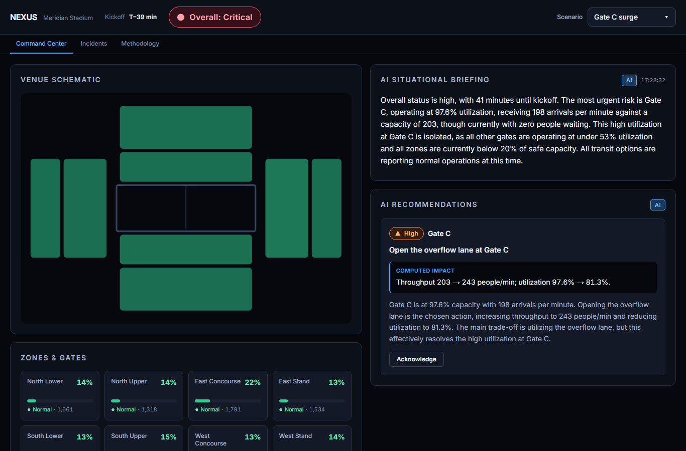
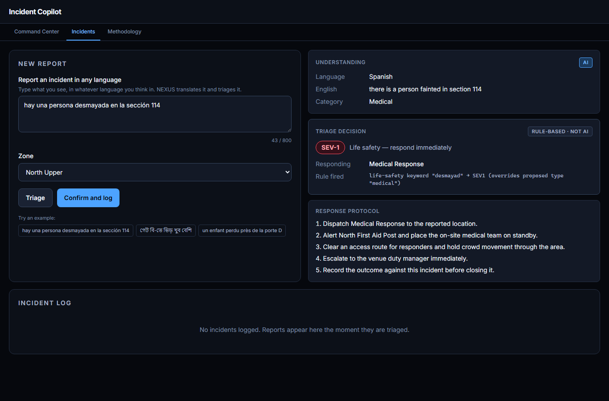
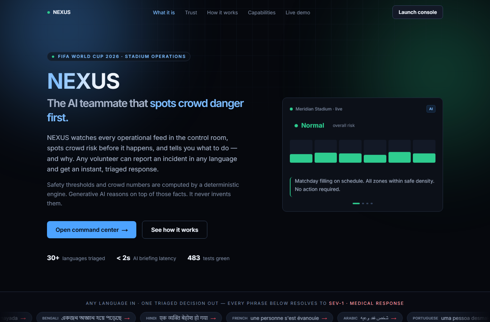
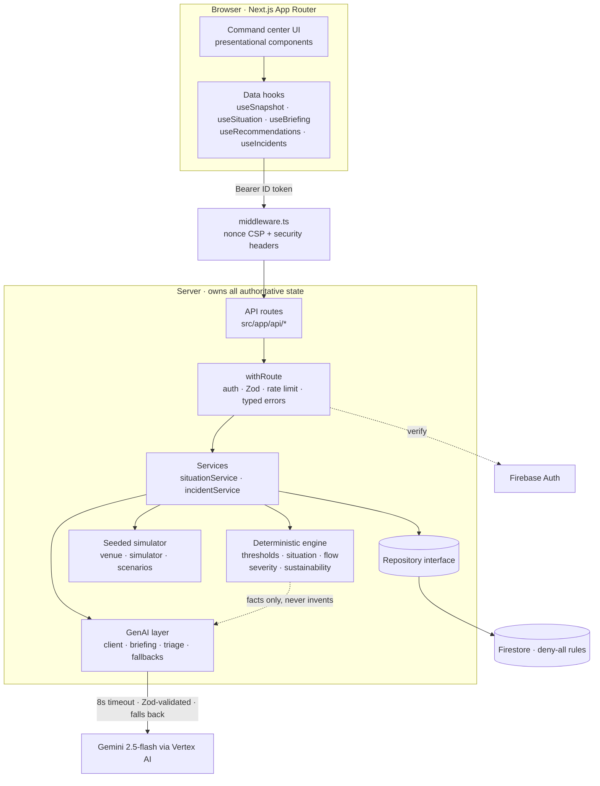

# NEXUS: AI Command Center for Stadium Operations

[](https://nexus-zuxwfnsdga-el.a.run.app) [](https://github.com/vedant7007/nexus/actions/workflows/ci.yml) [](LICENSE)

**▶ Live:** **https://nexus-zuxwfnsdga-el.a.run.app** (Google Cloud Run)

NEXUS is the AI teammate in a FIFA World Cup 2026 stadium control room. It watches
every operational feed, **spots crowd danger before it happens, tells you what to
do and why, and lets any volunteer report an incident in any language and get an
instant triaged response.**

> **Trying it as a reviewer?** On the
> [login page](https://nexus-zuxwfnsdga-el.a.run.app/login), create an account with
> email + password (self-service, no confirmation step) or use **Continue with
> Google**. Then pick the _“Gate C surge”_ scenario and follow the 20-second demo
> below.

---

## The 20-second demo

1. Open the **command center**. A normal matchday is filling; overall status reads **Normal**.
2. Pick the **"Gate C surge"** scenario from the picker.
3. Watch the engine react: the status pill climbs **Normal → High → Critical** and
   pulses, the schematic tints, and the **AI briefing rewrites itself in plain
   language**: _"Gate C is taking 215 arrivals a minute but can only process 195…
   the queue is growing by 20 people a minute."_
4. A **recommendation** appears with reasoning **and a real, engine-computed impact
   number**: _"Open the overflow lane at Gate C. Utilization 110.1% → 91.7%."_
5. Switch to **Incidents**, type _"hay una persona desmayada en la sección 114"_,
   and watch it get detected as Spanish, translated, and triaged **SEV-1 → Medical
   Response**: with the rule that fired quoted for audit.

That whole arc works **with the AI switched off** (rule-based mode): see below.

## Screens

|                        Command center, Gate C surge                         |                       Multilingual incident triage                       |
| :--------------------------------------------------------------------------: | :----------------------------------------------------------------------: |
|  |  |

<p align="center"></p>

## The one idea that makes this trustworthy

> **The AI has no shape in which to express a safety number.**

Generative AI is the product's brain, it writes the briefings, explains the
decisions, and understands incident reports in 30+ languages. But it is
**structurally prevented** from deciding anything safety-critical:

- The model's incident-triage output schema
  ([`triageProposalSchema`](src/lib/ai/triage.ts)) **has no `severity` field and
  no `team` field.** There is no shape in which it can express a triage decision.
  It proposes a _category_; the deterministic engine
  ([`classifySeverity`](src/lib/engine/severity.ts)) decides severity and routing
  from a keyword table, scanning **both** the raw report and the translation so a
  mistranslation cannot launder an emergency into a routine report. A life-safety
  keyword overrides the model's proposed category outright.
- Every crowd number, threshold, ETA, and "94% → 78%" impact figure comes from a
  pure, tested engine ([`src/lib/engine/`](src/lib/engine/)). The LLM is handed
  those facts and asked only to explain them.

The consequence is **testable, and tested**:
[`tests/ai/triage.test.ts`](tests/ai/triage.test.ts) asserts that **AI mode and
rule-based mode reach identical severity on life-safety reports across English,
Spanish, Bengali, and Hindi.** With Gemini switched off entirely, _"hay una persona
desmayada"_ is still SEV-1, still routed to Medical Response.

The [`/methodology`](src/app/methodology/page.tsx) page renders this claim, the
density thresholds and their sources, and the severity rules, every number
imported from the engine, not transcribed.

---

## Architecture



**Layering is strict:** route → `withRoute` → service → engine/ai/repository.
The engine is a pure function of its inputs; the simulator is a pure function of
`(scenario, tick)`; the AI is always last and always optional. The server owns
every safety-critical value, the client never computes one.

Key directories:

| Path                                 | Responsibility                                                                                                                |
| ------------------------------------ | ----------------------------------------------------------------------------------------------------------------------------- |
| [`src/lib/engine/`](src/lib/engine/) | Pure, tested safety math: thresholds, risk assessment, crowd-flow model, severity rules, sustainability. **≥95% covered.**    |
| [`src/lib/sim/`](src/lib/sim/)       | Seeded, deterministic simulator. Pure function of `(scenario, tick)` so multiple Cloud Run instances agree. **≥95% covered.** |
| [`src/lib/ai/`](src/lib/ai/)         | Gemini client (timeout + Zod + fallback), briefings, triage, deterministic fallbacks.                                         |
| [`src/lib/server/`](src/lib/server/) | Auth, the `withRoute` edge harness, typed errors, repository interface + Firestore impl + in-memory double.                   |
| [`src/lib/ui/`](src/lib/ui/)         | Typed API client, data hooks, one polling primitive, status vocabulary.                                                       |
| [`src/components/`](src/components/) | Radix-based, accessible, presentational components.                                                                           |

---

## Rubric-axis mapping

| Axis                         | How, with references                                                                                                                                                                                                                                                                                                                                                                                                                           |
| ---------------------------- | ---------------------------------------------------------------------------------------------------------------------------------------------------------------------------------------------------------------------------------------------------------------------------------------------------------------------------------------------------------------------------------------------------------------------------------------------- |
| **GenAI centrality**         | Briefings ([`ai/briefing.ts`](src/lib/ai/briefing.ts)), decision reasoning, and multilingual triage ([`ai/triage.ts`](src/lib/ai/triage.ts)) are all genuinely model-generated and load-bearing. Every AI route returns `mode: 'ai' \| 'rule'` so the UI shows which path served it.                                                                                                                                                           |
| **Safety / trustworthiness** | The LLM cannot set a severity, threshold, or crowd number, enforced by the schema shape, not convention. [`tests/ai/triage.test.ts`](tests/ai/triage.test.ts): "AI and rule modes reach identical severity" across 4 languages.                                                                                                                                                                                                               |
| **Resilience**               | Every AI call has an 8s timeout, Zod output validation, and a deterministic fallback ([`ai/fallbacks.ts`](src/lib/ai/fallbacks.ts)). Tested in [`tests/ai/`](tests/ai/) and end-to-end in [`e2e/demo-arc.spec.ts`](e2e/demo-arc.spec.ts) ("command center still works when the AI endpoints fail").                                                                                                                                            |
| **Code quality**             | TS strict, **zero `any`, zero non-null assertions**, strict ESLint (complexity, max-lines-per-function, import/order) with **zero warnings**. Layered architecture, repository interface + test double, Zod config module ([`config.ts`](src/lib/config.ts)), typed errors ([`server/errors.ts`](src/lib/server/errors.ts)), TSDoc on every export.                                                                                            |
| **Security**                 | Zod on every route, Firebase ID-token verification ([`server/auth.ts`](src/lib/server/auth.ts)), deny-all Firestore rules ([`firestore.rules`](firestore.rules)), nonce CSP + 6 security headers ([`middleware.ts`](src/middleware.ts), pinned by [`tests/middleware.test.ts`](tests/middleware.test.ts)), **Gemini via Vertex AI with a service account, no API key to store or leak**, rate-limited AI routes, `npm audit` 0 high/critical. |
| **Testing**                  | **483 unit/integration + 11 Playwright E2E.** Engine + sim **≥95%**, overall ~85%. Route tests cover 401/400/404/429 and AI-failure/fallback paths.                                                                                                                                                                                                                                                                                            |
| **Accessibility**            | **Lighthouse a11y 100 on every page**, axe zero (asserted in components _and_ real-browser E2E). Semantic landmarks, one `<h1>`/page, `aria-live` on updating panels, status always paired with a text label + icon ([`ui/status.ts`](src/lib/ui/status.ts)), keyboard-operable Radix controls, `prefers-reduced-motion` honored.                                                                                                              |
| **Efficiency**               | **Lighthouse Perf ≥98 mobile / 100 desktop on every page.** Firebase kept off public pages, panels memoised, zero CLS, modern browserslist, `output: 'standalone'`, `min-instances=1`.                                                                                                                                                                                                                                                         |
| **Problem alignment**        | Crowd management, real-time decision support, multilingual assistance, accessibility, transport, and sustainability, each a first-class feature, covered deeply rather than broadly.                                                                                                                                                                                                                                                          |

### Lighthouse (production build, mobile / desktop)

| Page           | Perf     | A11y      | Best Practices | SEO       |
| -------------- | -------- | --------- | -------------- | --------- |
| `/`            | 99 / 100 | 100 / 100 | 100 / 100      | 100 / 100 |
| `/login`       | 98 / 100 | 100 / 100 | 100 / 100      | 100 / 100 |
| `/dashboard`   | 99 / 100 | 100 / 100 | 100 / 96¹      | 100 / 100 |
| `/incidents`   | 98 / 100 | 100 / 100 | 100 / 100      | 100 / 100 |
| `/methodology` | 99 / 100 | 100 / 100 | 100 / 100      | 100 / 100 |

¹ A `/favicon.ico` probe artifact under Lighthouse; still ≥95.

---

## Run it locally

No cloud project is required. With no Firebase config the app runs in local-dev
mode (implicit identity, no sign-in); with no GCP credentials every AI feature
runs in deterministic rule-based mode.

```bash
npm install
npm run dev            # http://localhost:3000
```

Quality gates:

```bash
npm run typecheck      # tsc --noEmit (strict)
npm run lint           # strict ESLint, zero warnings
npm run test           # 483 unit/integration tests
npm run test:coverage  # with the ≥95% engine/sim gate
npm run e2e            # Playwright: demo arc + AI-down degradation
npm run build          # production build
```

To exercise real auth and Gemini locally, copy [`.env.example`](.env.example) to
`.env.local` and fill it in.

---

## Deploy

Target: **Google Cloud Run**, region `asia-south1`, `min-instances=1`.

**You provide** (NEXUS can't create cloud accounts):

1. A **GCP project** with an **active Cloud Billing account** (Gemini via Vertex
   AI bills to it, gemini-2.5-flash is a fraction of a cent per call).
2. A **Firebase project** (same GCP project): enable **Authentication**
   (Email/Password + Google) and **Firestore** (Native mode).
3. `.env.local` populated with the six `NEXT_PUBLIC_FIREBASE_*` values.

**No Gemini API key.** Gemini runs through **Vertex AI**, authenticated by the
Cloud Run service account (ADC) and billed to Cloud Billing, nothing to store,
rotate, or leak. (Vertex also sidesteps the AI-Studio API's separate,
region-specific prepaid-credit balance, which is unrelated to Cloud Billing.)

### One-shot script

```bash
gcloud auth login
gcloud config set project YOUR_PROJECT_ID
./scripts/deploy.sh
```

[`scripts/deploy.sh`](scripts/deploy.sh) is idempotent: it enables the APIs
(including Vertex AI), creates the Artifact Registry repo, builds and deploys via
Cloud Build (passing `NEXT_PUBLIC_FIREBASE_*` as **build args** so they are
inlined into the client bundle), grants the runtime service account
`roles/datastore.user` + `roles/aiplatform.user`, deploys the Firestore rules,
and prints the URL.

### Exact command sequence (what the script runs)

```bash
# 0. Auth + project
gcloud auth login
gcloud config set project YOUR_PROJECT_ID

# 1. Enable APIs (Vertex AI = aiplatform; no Secret Manager needed)
gcloud services enable run.googleapis.com cloudbuild.googleapis.com \
  artifactregistry.googleapis.com aiplatform.googleapis.com firestore.googleapis.com

# 2. Artifact Registry repo
gcloud artifacts repositories create nexus \
  --repository-format docker --location asia-south1

# 3. (nothing) - Gemini needs no key/secret; Vertex uses the runtime SA.

# 4. Build + deploy (NEXT_PUBLIC_* passed as BUILD ARGS via cloudbuild.yaml)
gcloud builds submit --config cloudbuild.yaml --substitutions \
_NEXT_PUBLIC_FIREBASE_API_KEY="$NEXT_PUBLIC_FIREBASE_API_KEY",\
_NEXT_PUBLIC_FIREBASE_AUTH_DOMAIN="$NEXT_PUBLIC_FIREBASE_AUTH_DOMAIN",\
_NEXT_PUBLIC_FIREBASE_PROJECT_ID="$NEXT_PUBLIC_FIREBASE_PROJECT_ID",\
_NEXT_PUBLIC_FIREBASE_STORAGE_BUCKET="$NEXT_PUBLIC_FIREBASE_STORAGE_BUCKET",\
_NEXT_PUBLIC_FIREBASE_MESSAGING_SENDER_ID="$NEXT_PUBLIC_FIREBASE_MESSAGING_SENDER_ID",\
_NEXT_PUBLIC_FIREBASE_APP_ID="$NEXT_PUBLIC_FIREBASE_APP_ID"

# 5. Least-privilege IAM for the Cloud Run runtime SA - Firestore + Vertex only
#    (PROJECT_NUMBER-compute@developer.gserviceaccount.com unless you set a custom SA)
gcloud projects add-iam-policy-binding YOUR_PROJECT_ID \
  --member serviceAccount:PROJECT_NUMBER-compute@developer.gserviceaccount.com \
  --role roles/datastore.user
gcloud projects add-iam-policy-binding YOUR_PROJECT_ID \
  --member serviceAccount:PROJECT_NUMBER-compute@developer.gserviceaccount.com \
  --role roles/aiplatform.user

# 6. Firestore deny-all rules
npx firebase-tools deploy --only firestore:rules --project YOUR_PROJECT_ID
```

### The one manual step people forget

**Google sign-in breaks on the live URL until you authorize the domain:**

> Firebase console → **Authentication → Settings → Authorized domains → Add domain**
> and paste the Cloud Run host (e.g. `nexus-xxxx-el.a.run.app`).

The deploy script prints this reminder with your exact host.

---

## Honest notes

- **Demo-mode auth bypass.** An explicit, opt-in `AUTH_BYPASS=1` env flag skips
  Firebase token verification. It exists so the whole product can be exercised
  with no cloud project (the E2E suite and a self-contained demo run this way,
  with an in-memory incident repository). It is **never set by a real
  deployment**, and [`tests/api/auth.test.ts`](tests/api/auth.test.ts) asserts a
  production request without the flag is always rejected. In that build the AI
  rate limiter is also skipped, because every request shares one synthetic
  identity, the real build enforces it, and the route tests cover it.
- **`npm audit`.** Zero **high/critical**. The remaining ~10 **moderate**
  advisories are all dev-only transitive dependencies of `firebase-admin` and
  `next` (they never ship in the container). `npm audit --audit-level=high`
  exits clean.
- **The simulator is fake, and says so.** The operational feed is a seeded
  deterministic simulation, but it conserves people, models a transit delay as
  the same crowd arriving later and tighter, and is calibrated so a normal
  matchday peaks at "high" (never a permanently-critical dashboard). The
  [`/methodology`](src/app/methodology/page.tsx) page is explicit about this.

## Stack

Next.js 15 (App Router) · React 19 · TypeScript strict · Tailwind v4 · Radix UI ·
Zod · Firebase Auth + Firestore (Admin SDK) · Gemini 2.5-flash (Vertex AI) · Vitest +
Testing Library + vitest-axe · Playwright + axe-core · Cloud Run + Cloud Build +
Artifact Registry.

## License

[MIT](LICENSE) © 2026 Vedant.
